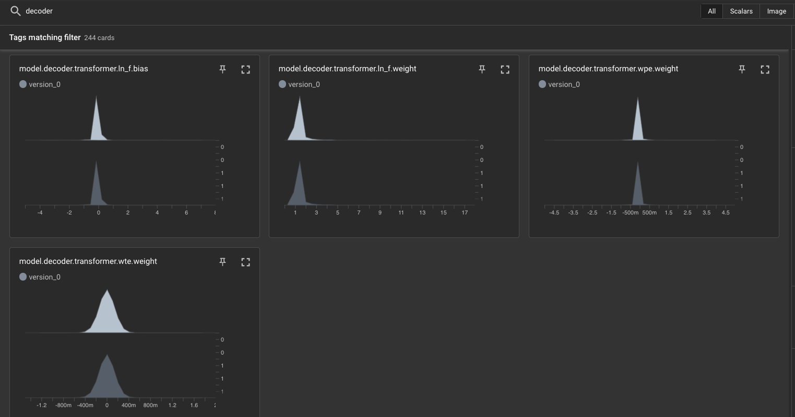

# Image captioning fine-tuning pipeline using pytorch lightening and hydra


Purpose:
- Provide proof of concept for how pre-trained image captioning model can be fine-tuned to solve similar tasks in different domains
- Demontrate how to utilize pytorch lightening, hydra and poetry to optimize model development and evaluation pipeline


Code contribution:
- Datamodules to process Flickr and medicat dataset (src/datamodule)
- VitGPT2 fine-tuning pipeline written using pytorch lightening (src/models)
- Text generation evaluation and model training monitoring (demo.ipynb, src/evaluate.py)
- Adaptation of pytorch-lightening / hydra template for image captioning (configs, train.py)

Resources used in this project:
- Pre-trained image captioning model used: https://huggingface.co/nlpconnect/vit-gpt2-image-captioning
- Flickr image captioning dataset: https://www.kaggle.com/datasets/adityajn105/flickr30k
- Medicat medical image captioning dataset: https://github.com/allenai/medicat
- Poetry (python package and dependency management): https://python-poetry.org/
- Pytorch lightening + hydra template: https://github.com/ashleve/lightning-hydra-template
- pyroot utils (root path management for hydra): https://github.com/ashleve/pyrootutils

Training notes:
- The last layer of the Vit encoder and GPT2 decoder were unfrozen for fine-tuning, and the rest of the layers were frozen
- 10,000 samples from the dataset were used to train the model
- The model was trained with batch size 64 for 5 number of epochs
- NOTE: these training decisions were largely influenced by lack of personal compute resources

## A. Image captioning transfer learning on Flickr dataset

- Purpose: to test out the fine-tuning pipeline on a similar domain image captioning dataset

**Training**

```
poetry run python train.py datamodule='flickr.yaml'
poetry run python train.py datamodule='flickr.yaml' trainer='default.yaml' # to run on CPU
poetry run python train.py datamodule='flickr.yaml' datamodule.num_samples=5000 # to run on a smaller subset of the data

```

- To run on google colab, run 'run_flickr.ipynb'


**Evaluation**
- The best model run (outputted from hydra) was transferred to this folder: src/demo/flickr/

- The train and validation loss is shown below. Although it was difficult to see signs of overfitting / underfitting due to lack of number of epochs trained, we could see that both train and validation loss decrease over time which suggest that the model was making progress in learning. 


- The histogram of the encoder and decoder weights were logged on tensorboard. This model did not train for many epochs due to lack of personal compute resources. However, because the flickr dataset is in similar domain to the one that the model was trained on, we expect to see only small changes in the distribution of the weights as we observe in these histograms. 





- Here are the fine-tuned model's outputs to sample images in the test set. We see that the predicted captions are partially correct and simple, but contain some errors in describing the details. 


